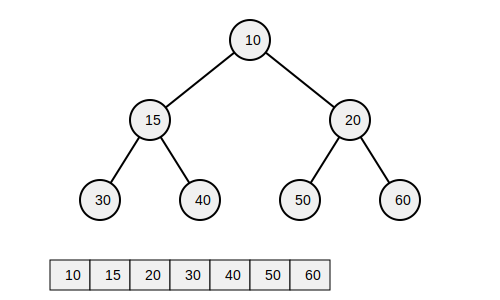
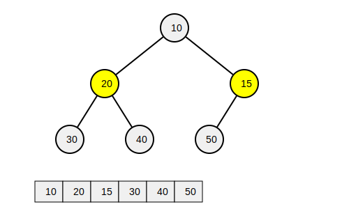

# Heap

Specialized tree-based data structure satisfying the heap property: that the root node always contains the minimum (min heap) or maximum (max heap) value.

## Explanation

A typical binary heap is a tree stored as a contiguous array. The tree is always complete, because it is filled from left to right -- meaning that the array is always contiguous.

Remember that the elements are **not guaranteed to be ordered** -- and it is different therefore from a **sorted array**. The only guarantee is that the root node is the minimum (min heap) or maximum (max heap) value.

Heaps are optimized for <mark>fast operations against the root node</mark>: insertions (of new minimum), deletions (of minimum), and reads (of minimum). But these

Contiguity of the array is maintained. When an element is deleted, it is replaced by the last element, which is then bubbled down to its correct place.

## Implementation

Implementation requirements:

- `insert(element)`
- `extract_min()` (for min-heap) or `extract_max()` (for max-heap)
- `heapify()`
- `build_heap(array)`

Implementation focus:

- Implement both min-heap and max-heap
- Array-based implementation
- Use heap to implement a priority queue

## Use Cases

Common use-cases for a min or max heap are:

- <mark>**Priority queues**: Where it is necessary only to access the highest priority item at any given time. Priority queues are commonly used in task scheduling.</mark>
- **Dijstra's shortest path algorithm**: Where it is necessary to find the shortest path (minimum priority) from one node to all other nodes.
- **Huffman coding**: Where the most frequent elements get the shortest codes.
- **Median finding algorithms**: Where a min heap (less half) and max heap (greater half) are used in conjunction to track the middle two elements.
- **Heap sort**: Where a min heap is created (O(n) time) and then extracted from repeatedly (O(logn) time) to sort a list.

It is worth noting that the "heap" referred to in program memory management - which is simply a contiguous block of memory allocated to a program - is distinct from the "heap" data structure described here. However, some memory allocators the memory **within** the heap employ min heaps to do so -- tracking the smallest available block of memory as the minimum.
